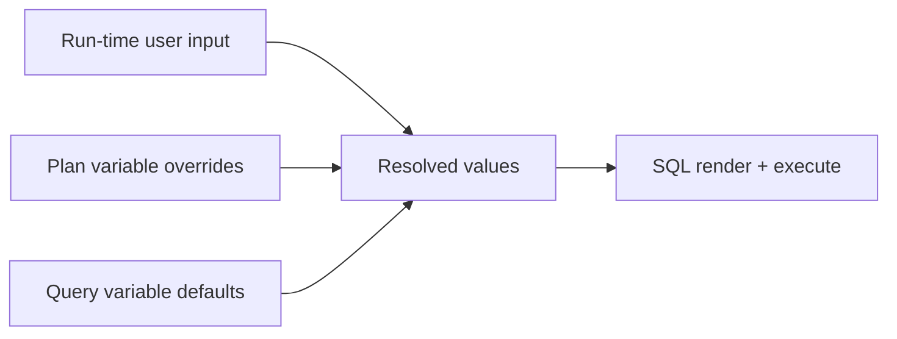

# Runtime And Variable Context

Future-context reference for how query variables flow through ad-hoc runs, plan runs, and plan-level default overrides. This is not a numbered execution plan — link here when implementing run confirmation UI or plan variable editors.

## Goal

Document how variable values are collected, overridden, and resolved before SQL is rendered and executed — across ad-hoc query runs, plan runs, and plan-specific default configuration.

## Context Layers

| Layer | Scope | Defined where | Used when |
|-------|-------|---------------|-----------|
| Query variable definitions | Per query version | Query editor → Variables tab | Authoring; defines `name`, `type`, `defaultValue`, `required` |
| Query variable defaults | Per query version | Query editor → Variables tab | Fallback when no plan override or run-time input |
| Plan variable overrides | Per plan | Plan editor → variable defaults section (future) | Plan runs only; overrides query defaults for that plan |
| Run-time user input | Per run | Pre-run confirmation dialog (future) | Ad-hoc and plan runs; highest priority |

## Pre-Run Variable Confirmation (Ad-Hoc + Plan)

Before any ad-hoc query run or plan run executes:

1. Show a confirmation dialog listing **all variables** that will be used for that run.
2. User confirms and fills in:
   - Variables with **no default value**
   - Variables flagged **required at runtime** (force collection even if a default exists)
3. User can accept pre-filled values from defaults, plan overrides, or prior context.

This dialog is distinct from:

- **Query editor preview values** — override defaults for backend SQL preview only; not saved.
- **Plan default variable editor** — persistent plan-level overrides, not per-run confirmation.

## Plan-Level Default Variable Editor

Each plan gets its own variable-default editor:

- Variables are **derived only from queries in the plan** — users cannot add new variable definitions at plan level.
- Editor shows each query's variables and their query-level defaults.
- Plan can set new default values for that specific plan execution context.
- Cannot introduce variables that don't exist on the underlying query version.

## Resolution Order

When SQL is rendered for execution, merge variable values in this order (highest priority first):

1. **Run-time user input** — values from pre-run confirmation dialog
2. **Plan variable overrides** — plan-specific defaults (plan runs only)
3. **Query variable defaults** — defaults on the resolved query version

Aligns with [Plan 04: Plans And Execution](04-suites-and-execution.md) execution rules.

## Frontend Implications (Future Work)

- **`RunVariableConfirmationDialog`** — shared component for ad-hoc and plan run confirmation; collects missing/required-at-runtime values.
- **Plan builder section** — "Variable defaults": read-only variable list grouped by query + editable override values only.
- **Query editor Variables tab** — remains the **definition** surface (`name`, `type`, `defaultValue`, `required at run time`).

## API Implications (Future Work)

- Plan CRUD should accept `variableOverrides[]` keyed by query + variable name (no new variable definitions).
- Run endpoints should accept final run-time variable map after user confirmation.
- Backend validates all required variables are present before execution (already partially in Plan 02.6).

## Verification Checklist (When Implemented)

- Ad-hoc run blocks until required/missing variables are filled in confirmation dialog.
- Plan run shows all variables from all plan queries in one confirmation step.
- Plan default editor only shows variables from queries in that plan.
- Plan cannot save an override for a variable name that does not exist on the pinned query version.
- Resolution order matches: run-time input → plan overrides → query defaults.

## Anti-Pattern Guards

- Do not let plans define variables that are not on the underlying query version.
- Do not skip pre-run confirmation for variables marked required at runtime.
- Do not conflate editor preview overrides with run-time or plan-level values.
- Do not silently fall back when a required variable has no resolvable value — return 400 with a clear message.

## Related Plans

- [Plan 02.6: Query Versioning And Variables](02.6-query-versioning-and-variables.md) — variable definitions and `{{name}}` syntax
- [Plan 04: Plans And Execution](04-suites-and-execution.md) — plan runs and merge order
- [Frontend UI Conventions](frontend-ui-conventions.md) — tabbed editor patterns
