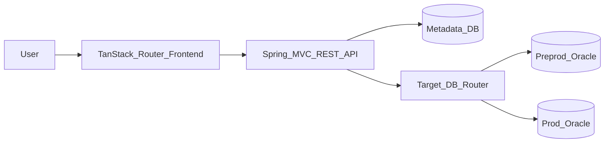

# Plan 00: Documentation Discovery

## Goal

Establish the documented APIs and implementation constraints before creating any backend or frontend code. This phase prevents the MVP from drifting into undocumented Spring Boot, Oracle, or TanStack Router assumptions.

## Scope

- Confirm Spring Boot `4.1.0`, Java `25`, Maven, jar packaging, and `application.properties` configuration support.
- Confirm Spring MVC REST controller, Spring Data JPA, validation, H2, and Oracle JDBC dependency names for the generated backend.
- Confirm TanStack Router file-based routing setup for a Vite React frontend.
- Confirm the metadata database and target audit database are separate concepts.
- Record the database safety rules for executing user-authored SQL audits.

## Documentation To Consult

- Spring Initializr for the backend coordinates:
  - Group: `com.test`
  - Artifact: `backend`
  - Java: `25`
  - Spring Boot: `4.1.0`
  - Packaging: `jar`
  - Build: Maven
- Spring Boot 4.1 reference documentation for:
  - Spring MVC REST controllers
  - Spring Data JPA
  - externalized configuration and profiles
  - application startup and testing
- H2 documentation for local development compatibility mode.
- Oracle JDBC documentation for the Oracle driver and JDBC URL shape.
- TanStack Router documentation for Vite React file routes.

## Key Architecture Decision

The application has two database roles:

- Metadata database: stores environments, projects, audit queries, categories, suites, and run history. Use H2 locally and Oracle when deployed.
- Target audit database: the selected environment/project database where stored SQL audit queries execute.

Do not treat the runtime environment switch as a Spring profile switch. Spring profiles configure the application itself; the user-facing environment selector chooses the target audit connection for each run.

## Allowed MVP APIs And Patterns

- Use `@RestController` for JSON API endpoints under `/api`.
- Use Spring Data JPA repositories only for metadata entities.
- Use JDBC for executing audit SQL against selected target databases.
- Use `application-local.properties` for H2 metadata development.
- Use `application-oracle.properties` for Oracle metadata deployment configuration.
- Use TanStack Router routes for frontend pages; do not add server-rendered MVC views.

## Anti-Pattern Guards

- Do not use JPA entities to model arbitrary audited customer tables.
- Do not run audit SQL through the metadata JPA `EntityManager`.
- Do not seed fake customer data or fake customer schemas.
- Do not hard-code production Oracle credentials in properties files.
- Do not allow multi-statement SQL, DML, DDL, or stored procedure execution in the MVP.
- Do not introduce a SQL templating engine until section toggles are proven insufficient.

## Verification Checklist

- Backend dependency names and Java version are confirmed against current Spring Boot 4.1 documentation.
- Oracle JDBC dependency and runtime configuration approach are documented.
- TanStack Router setup steps are confirmed from current docs.
- The separation between metadata DB and target audit DB is reflected in every later plan.

