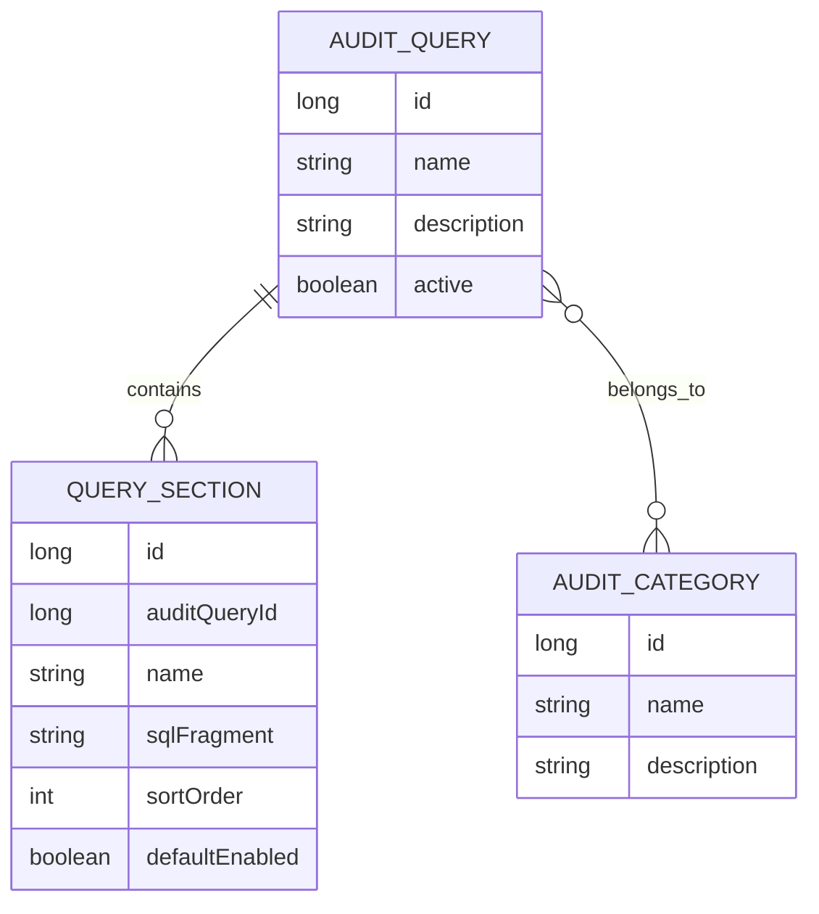

# Plan 02: Audit Queries And Categories

## Goal

Add the metadata model for storing reusable SQL audit definitions and organizing them into categories. This phase still does not execute queries against customer databases.

## What To Implement

- Add JPA metadata entities for:
  - `AuditQuery`
  - `QuerySection`
  - `AuditCategory`
- Add a many-to-many relationship between `AuditQuery` and `AuditCategory`.
- Store each audit query as ordered sections instead of one large SQL string.
- Add REST endpoints for CRUD operations.
- Add frontend pages for listing, creating, and editing queries and categories.
- Allow query sections to be enabled or disabled by default.
- Show a rendered SQL preview by concatenating enabled sections in order.

## Proposed Metadata Model



## Query Section Rules

- A query is made from one or more ordered sections.
- Each section contains a SQL fragment.
- Each section has `defaultEnabled`.
- The backend renders SQL by joining enabled sections in `sortOrder`.
- The frontend edits sections as separate blocks.
- The MVP does not need a template language.

Example concept only:

```sql
SELECT *
FROM SOME_TABLE
WHERE 1 = 1
-- optional sections can add more predicates
```

Do not add this as seed data. It is only a shape example for implementers.

## Backend API Shape

- `GET /api/audit-queries`
- `POST /api/audit-queries`
- `GET /api/audit-queries/{id}`
- `PUT /api/audit-queries/{id}`
- `DELETE /api/audit-queries/{id}`
- `GET /api/audit-categories`
- `POST /api/audit-categories`
- `PUT /api/audit-categories/{id}`
- `DELETE /api/audit-categories/{id}`
- `GET /api/audit-queries/{id}/preview`

## Frontend Pages

- `/audit-queries`
  - list queries
  - create query
  - edit query metadata
  - add, reorder, enable, disable, and edit sections
  - assign categories
  - preview rendered SQL
- `/audit-categories`
  - list categories
  - create and edit categories
  - show how many queries use each category

## Verification Checklist

- Backend repository tests cover query/category persistence.
- Service tests cover SQL preview assembly order.
- API tests cover create, update, list, and preview flows.
- Frontend build succeeds.
- Manual local check can create a query with multiple sections and assign it to multiple categories.

## Anti-Pattern Guards

- Do not execute audit SQL yet.
- Do not model audited customer tables in JPA.
- Do not add fake customer schemas or fake customer data.
- Do not store project-specific overrides yet.
- Do not allow query category assignment to depend on environment or project yet.
- Do not introduce a complex SQL parser or template engine in the MVP.

