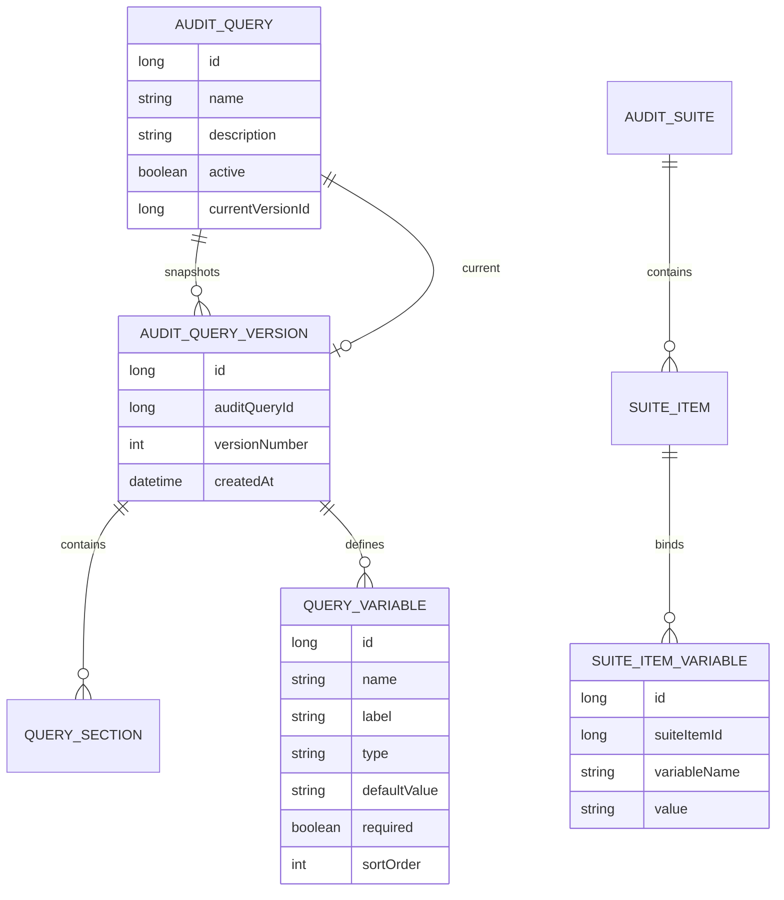

# Plan 02.6: Query Versioning and Variables

## Goal

Add immutable auto-snapshot query versioning on every save, define typed query variables referenced in SQL fragments, and wire variable value configuration for suite runs and ad-hoc runs.

## What To Implement

- Split `AuditQuery` into a logical query and immutable `AuditQueryVersion` snapshots.
- Auto-snapshot on every `PUT`: each save creates a new version; latest is default for new runs.
- Add `QueryVariable` definitions per version (`STRING`, `NUMBER`, `DATE`).
- Support `{{variableName}}` placeholders in SQL fragments with typed, safe substitution.
- Change preview from `GET` to `POST` with optional variable values.
- Add version list and read-only version detail endpoints.
- Add suite item variable bindings (`SuiteItemVariable`) for per-query-in-suite configuration.
- Add ad-hoc query run endpoint that resolves variables and stores rendered SQL.
- Add frontend variable editor, version badge, interactive preview, suite variable bindings, and ad-hoc run UI.

## Proposed Metadata Model

## Variable Syntax

Use `{{variableName}}` in `sqlFragment` values. Substitution is typed and escaped — not a general template engine.

## Backend API Shape

- `GET /api/audit-queries` — include `versionNumber`, `versionId`
- `GET /api/audit-queries/{id}` — current version sections + variables
- `PUT /api/audit-queries/{id}` — accept `variables[]`; create new version
- `GET /api/audit-queries/{id}/versions`
- `GET /api/audit-queries/{id}/versions/{versionId}`
- `POST /api/audit-queries/{id}/preview` — body: `{ variables?, versionId? }`
- `POST /api/audit-queries/{id}/runs` — ad-hoc run with variables
- Suite item CRUD accepts `variableBindings[]` and optional `auditQueryVersionId`

## Verification Checklist

- Saving twice produces versions 1 and 2; v1 unchanged
- Variable substitution: STRING escaping, NUMBER validation, DATE formatting
- Missing required variable returns 400
- Unresolved `{{token}}` rejected before execution
- Preview POST returns same SQL execution would use
- Suite item bindings and ad-hoc form values resolve correctly
- Existing Plan 02 queries migrate to v1

## Anti-Pattern Guards

- No general template engine (`if`/`for`/expressions)
- No unescaped string interpolation
- No mutation of past versions
- No silent dropping of unresolved placeholders

## Related Context

- [Runtime And Variable Context](runtime-and-variable-context.md) — pre-run confirmation, plan default overrides, and resolution order (future)
- [Frontend UI Conventions](frontend-ui-conventions.md) — query editor tab layout (Details / Query / Variables)
