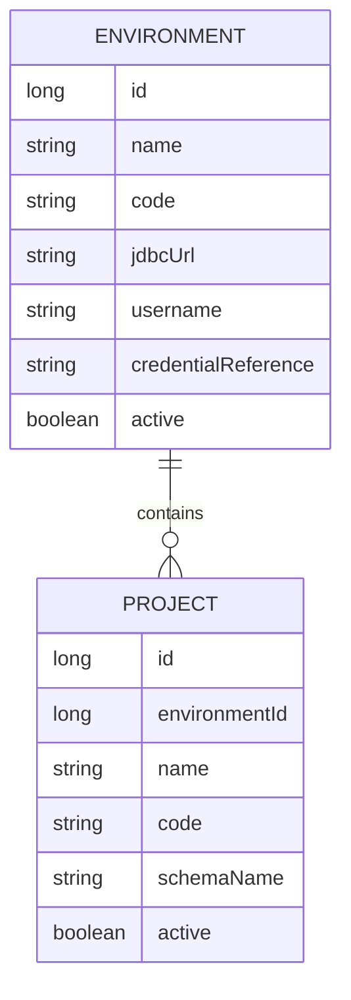
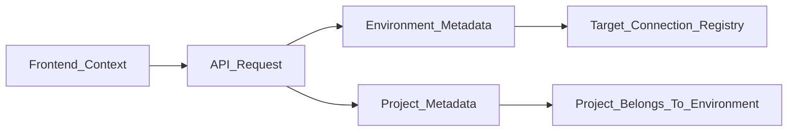

# Plan 03: Environments And Projects

## Goal

Add the application-level context that decides where audit queries run. An environment is a database server or Oracle host such as preprod or prod. A project is a customer project inside that environment and Oracle SID.

## What To Implement

- Add JPA metadata entities for:
  - `Environment`
  - `Project`
- Add REST endpoints for managing environments and projects.
- Add frontend management pages for environments and projects.
- Add an application-level selected environment and selected project context.
- Add backend request validation so query execution endpoints later require an environment and project.
- Add a target database connection registry service, but do not execute audits yet.

## Proposed Metadata Model

## Environment Rules

- Environment represents the server/database host where target audit SQL runs.
- Examples: `preprod`, `prod`.
- Environments are application data, not Spring profiles.
- Environment records may store non-secret connection metadata.
- Secrets should be supplied through environment variables, a local secret file excluded from git, or a future secret manager.

## Project Rules

- Project represents a customer project inside an environment.
- Projects may share the same Oracle SID in one environment.
- A project can carry schema-related metadata such as `schemaName`.
- Project-specific behavior should be limited in this phase to selection context and metadata. Detailed query overrides are deferred.

## Runtime Context

Use a simple MVP context:

- Frontend stores selected `environmentId` and `projectId` in URL search params or browser storage.
- API requests that need context pass `environmentId` and `projectId` explicitly.
- Backend validates that the project belongs to the selected environment.

## Backend API Shape

- `GET /api/environments`
- `POST /api/environments`
- `GET /api/environments/{id}`
- `PUT /api/environments/{id}`
- `DELETE /api/environments/{id}`
- `GET /api/environments/{id}/projects`
- `GET /api/projects`
- `POST /api/projects`
- `GET /api/projects/{id}`
- `PUT /api/projects/{id}`
- `DELETE /api/projects/{id}`
- `POST /api/environments/{id}/test-connection`

## Frontend Pages

- `/environments`
  - list environments
  - create and edit environments
  - mark environments active or inactive
  - test connection where credentials are configured locally
- `/projects`
  - list projects for the selected environment
  - create and edit project metadata
  - select active project for future audit runs

## Verification Checklist

- Backend tests verify a project must belong to an environment.
- Backend tests verify inactive environments and projects cannot be selected for future runs.
- Local startup works without real Oracle credentials.
- Frontend can select an environment and project.
- Connection testing fails gracefully when credentials are missing.

## Anti-Pattern Guards

- Do not switch Spring profiles when the user changes environment in the UI.
- Do not store plaintext production passwords in metadata tables.
- Do not run audit queries yet.
- Do not require Oracle credentials for local H2 metadata development.
- Do not assume one project equals one Oracle SID.
- Do not hard-code customer-specific behavior in Java code.

