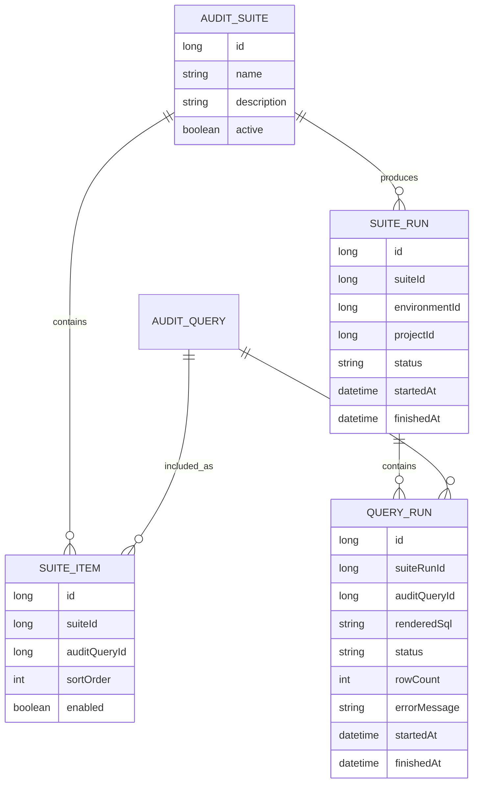

# Plan 04: Suites And Execution

## Goal

Allow users to group audit queries into suites and run them sequentially for a selected environment and project. This is the first phase where stored audit SQL is executed against a target database.

## What To Implement

- Add JPA metadata entities for:
  - `AuditSuite`
  - `SuiteItem`
  - `SuiteRun`
  - `QueryRun`
- Add REST endpoints for suite CRUD.
- Add REST endpoint to run a suite for a selected environment and project.
- Render enabled query sections into SQL before execution.
- Execute suite items sequentially in `sortOrder`.
- Store run status, rendered SQL, timing, row count, and error message.
- Add frontend suite builder and run history views.

## Proposed Metadata Model

## Execution Rules

- A run must specify `suiteId`, `environmentId`, and `projectId`.
- Backend validates that the project belongs to the environment.
- Backend renders SQL from enabled query sections.
- Backend executes only one suite item at a time.
- Failed query behavior is configurable in the suite item or suite:
  - MVP default: stop the suite on first failed query.
- Store the rendered SQL used for each `QueryRun` for auditability.
- Store result summary only in the MVP, not full result sets.

## SQL Safety Rules

- Use a read-only database user for target audit connections.
- Set query timeout.
- Reject obvious non-read-only statements:
  - `insert`
  - `update`
  - `delete`
  - `merge`
  - `drop`
  - `alter`
  - `create`
  - `truncate`
  - `grant`
  - `revoke`
- Reject multi-statement SQL in the MVP.
- Limit returned rows if result previews are added later.

## Backend API Shape

- `GET /api/audit-suites`
- `POST /api/audit-suites`
- `GET /api/audit-suites/{id}`
- `PUT /api/audit-suites/{id}`
- `DELETE /api/audit-suites/{id}`
- `POST /api/audit-suites/{id}/items`
- `PUT /api/audit-suites/{id}/items/{itemId}`
- `DELETE /api/audit-suites/{id}/items/{itemId}`
- `POST /api/audit-suites/{id}/runs`
- `GET /api/audit-suites/{id}/runs`
- `GET /api/suite-runs/{runId}`

## Frontend Pages

- `/audit-suites`
  - list suites
  - create and edit suite metadata
  - add queries to a suite
  - order suite items
  - enable or disable suite items
  - run suite for selected environment and project
  - view suite run history
  - view query run statuses

## Overnight MVP Interpretation

The first execution version can be manually triggered and sequential. That gives the same core behavior needed for overnight runs without scheduling complexity. True scheduled overnight execution is deferred to Plan 05.

## Verification Checklist

- Backend tests verify suite item ordering.
- Backend tests verify SQL rendering before execution.
- Backend tests verify rejected DML and DDL statements are not executed.
- Backend tests verify failed suite behavior.
- Local H2 test can execute an abstract read-only query against a controlled test table created by the test itself.
- Frontend can create a suite, add stored queries, trigger a run, and view run history.

## Anti-Pattern Guards

- Do not run suite items in parallel in the MVP.
- Do not store full customer result sets unless a later requirement asks for it.
- Do not treat query failures as successful audit results.
- Do not ignore environment/project context during execution.
- Do not add cron scheduling in this phase.
- Do not bypass SQL safety checks for convenience.

