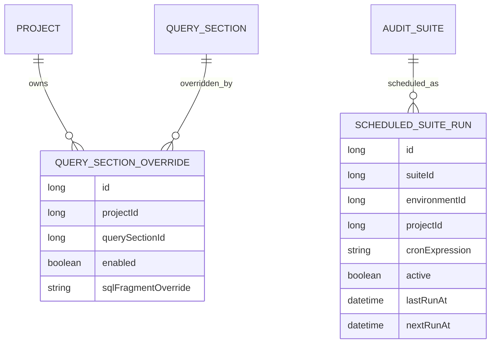

# Plan 05: Overrides And Scheduled Runs

## Goal

Add controlled project-specific variation and simple overnight scheduling after the basic query, environment, project, suite, and manual execution flows are working.

## What To Implement

- Add project-specific overrides for query sections.
- Add suite-specific or suite item-specific section enablement overrides.
- Add a scheduled run configuration for overnight execution.
- Add frontend controls for toggling overrides before saving a suite or run configuration.
- Add run configuration previews so users can see the final rendered SQL before scheduling.

## Proposed Metadata Additions

## Override Rules

- Base query sections remain the source of truth.
- A project override can:
  - enable a section
  - disable a section
  - optionally replace a section SQL fragment
- Override resolution order:
  - query section default
  - project-specific section override
  - future run-specific override if added later
- Every `QueryRun` stores the final rendered SQL so historical results remain explainable.

## Scheduling Rules

- Start with a simple scheduled suite configuration.
- Use Spring scheduling for the MVP.
- Only active schedules run.
- Each scheduled run creates a normal `SuiteRun`.
- A schedule must specify suite, environment, and project.
- Prevent overlapping runs for the same schedule.
- Store last run and next run timestamps where practical.

## Frontend Pages

- `/audit-queries`
  - show project override status for sections when a project is selected
  - allow editing project-specific section toggles
- `/audit-suites`
  - configure overnight schedule
  - show active schedules
  - preview final rendered SQL for selected environment and project
  - show scheduled run history alongside manual runs

## Verification Checklist

- Backend tests verify override resolution order.
- Backend tests verify rendered SQL includes the correct project-specific sections.
- Backend tests verify schedules create normal suite runs.
- Backend tests verify overlapping scheduled runs are prevented.
- Frontend can configure and disable a schedule.
- Frontend can preview final rendered SQL before saving a schedule.

## Anti-Pattern Guards

- Do not duplicate whole queries for every project when a section override is enough.
- Do not add a general-purpose template language unless section overrides are no longer adequate.
- Do not allow scheduled runs without an explicit environment and project.
- Do not run overlapping schedules for the same suite/environment/project combination.
- Do not hide overridden SQL from run history.
- Do not add user permissions or approval workflows in this phase.

