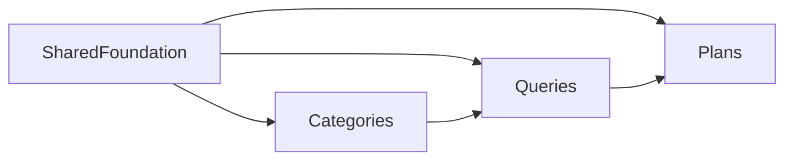

# Replication guide

Copy-file guide for porting this project into another app in dependency order: **Categories → Queries → Plans**.

Schema for all three features comes from JPA entities (local H2 uses `ddl-auto=create-drop`). There are no Flyway/Liquibase migrations to copy for these features.



Do **not** hand-copy generated files as source of truth:

- `frontend/src/lib/api-schema.d.ts` — regenerate with `pnpm openapi:generate` (backend must be running)
- `frontend/src/routeTree.gen.ts` — regenerated by `@tanstack/router-plugin` when route files exist

---

## 0. Shared foundation (once, before any feature)

### Frontend packages to install

From `frontend/package.json` (pnpm). Install these before copying feature code.

**Core**

```bash
pnpm add react react-dom
pnpm add -D typescript vite @vitejs/plugin-react tailwindcss @tailwindcss/vite tw-animate-css
```

Also used in this repo: `@vitejs/plugin-basic-ssl`, `babel-plugin-react-compiler`, `@babel/core`, `@rolldown/plugin-babel`, `@types/react`, `@types/react-dom`.

**Data / routing / forms**

```bash
pnpm add @tanstack/react-router @tanstack/react-query @tanstack/react-query-devtools @tanstack/react-form zod zod-validation-error openapi-fetch
pnpm add -D @tanstack/router-plugin openapi-typescript
```

**UI stack**

```bash
pnpm add radix-ui class-variance-authority clsx tailwind-merge lucide-react @phosphor-icons/react sonner next-themes @fontsource-variable/inter
pnpm add -D shadcn
```

**Feature-specific** (also listed again under each feature)

```bash
pnpm add pluralize @dnd-kit/react
pnpm add -D @types/pluralize
```

**Tooling (optional but used here)**

```bash
pnpm add -D @biomejs/biome knip vitest
```

Wire Vite to proxy `/api` → `http://localhost:8080`, and set path alias `@/*` → `./src/*`.

### Shared frontend files to copy

**Libs**

| Path | Role |
|------|------|
| `frontend/src/lib/http-client.ts` | `openapi-fetch` client + `unwrapData` |
| `frontend/src/lib/query-client.ts` | Shared TanStack Query client |
| `frontend/src/lib/api-types.ts` | Domain types derived from OpenAPI |
| `frontend/src/lib/format-zod-error.ts` | Zod → user-facing messages |
| `frontend/src/lib/utils.ts` | `cn()` |
| `frontend/src/lib/build-nav-tree.ts` | Sidebar nav from route `staticData.nav` |
| `frontend/src/lib/query/optimistic-list-mutations.ts` | Persist/remove list mutations + toasts |

**Workspace chrome** (list + editor shell used by all three features)

| Path |
|------|
| `frontend/src/components/workspace/list/detail-layout.tsx` |
| `frontend/src/components/workspace/list/sidebar.tsx` |
| `frontend/src/components/workspace/list/sidebar-item.tsx` |
| `frontend/src/components/workspace/error-panel.tsx` |
| `frontend/src/components/workspace/editor/page.tsx` |
| `frontend/src/components/workspace/editor/actions.tsx` |
| `frontend/src/components/workspace/editor/form-section.tsx` |
| `frontend/src/components/workspace/editor/name-description-fields.tsx` |
| `frontend/src/components/workspace/editor/variable-value-fields.tsx` |

**App shell / nav**

| Path | Role |
|------|------|
| `frontend/src/main.tsx` | `QueryClientProvider` + `RouterProvider` |
| `frontend/src/routes/__root.tsx` | Theme, sidebar layout, toaster |
| `frontend/src/components/app-sidebar.tsx` | Renders nav tree |
| `frontend/src/components/mode-toggle.tsx` | Theme toggle |
| `frontend/src/hooks/use-mobile.ts` | Sidebar mobile breakpoint |
| `frontend/src/types/router.ts` | `staticData.nav` typing |
| `frontend/src/styles.css` | Tailwind / theme tokens |

**UI primitives needed by the shell + workspace** (under `frontend/src/components/ui/`)

`sidebar`, `sheet`, `tooltip`, `sonner`, `button`, `separator`, `skeleton`, `dropdown-menu`, `collapsible`, `alert`, `alert-dialog`, `spinner`, `empty`, `input`, `textarea`, `label`, `field`, `field-label`, `badge`, `card`

(Or re-add via shadcn using `frontend/components.json` — style `radix-lyra`.)

### Shared backend (once)

| Path | Role |
|------|------|
| `backend/src/main/java/com/test/backend/BackendApplication.java` | Boot entry |
| `backend/src/main/java/com/test/backend/service/ServiceSupport.java` | `notFound`, `activeOrDefault` |
| `backend/src/main/java/com/test/backend/config/GlobalExceptionHandler.java` | `ResponseStatusException` → ProblemDetail |

**Maven stack** (from `backend/pom.xml`): Spring Boot **4.1.0**, Java **25**, `spring-boot-starter-webmvc`, `data-jpa`, `validation`, MapStruct **1.6.3**, Lombok, springdoc-openapi **3.0.2**, H2 + Oracle JDBC runtimes.

Copy application profiles as needed: `application.properties`, `application-local.properties`, `application-oracle.properties`.

---

## 1. Categories

First feature. Standalone CRUD. Query-count badges light up fully after Queries is copied.

### Packages

```bash
pnpm add pluralize
pnpm add -D @types/pluralize
```

Also uses (already installed in foundation): `@tanstack/react-form`, `@tanstack/react-query`, `@tanstack/react-router`, `zod`, `openapi-fetch`, `@phosphor-icons/react` (`TagIcon`).

### Frontend — copy

**Feature folder** — entire `frontend/src/features/categories/`:

| File | Role |
|------|------|
| `api.ts` | HTTP wrappers for `/api/categories` |
| `schema.ts` | Zod request schema |
| `form.ts` / `form.test.ts` | Form helpers |
| `server-state.ts` | React Query keys + mutations |
| `use-editor.ts` | Create/edit/delete orchestration |
| `use-query-counts.ts` | Counts from queries list |
| `utils.ts` / `utils.test.ts` | Count derivation |
| `editor.tsx` | Create/edit UI |
| `list.tsx` | Sidebar list |

**Routes** — entire `frontend/src/routes/categories/`:

| File | Route |
|------|-------|
| `route.tsx` | `/categories` layout + nav |
| `index.tsx` | redirect → `/categories/new` |
| `new.tsx` | create |
| `$categoryId.tsx` | edit |

**UI primitives used by categories** (if not already copied): `badge`, `field`, `field-label`, `input`, `textarea` (+ workspace stack: `button`, `empty`, `alert`, `alert-dialog`, `spinner`, `label`, `separator`).

Until Queries exists, `use-query-counts` will show empty/zero counts — that is expected.

### Backend — copy

| Path |
|------|
| `backend/.../controller/category/CategoryController.java` |
| `backend/.../service/category/CategoryService.java` |
| `backend/.../repository/category/CategoryRepository.java` |
| `backend/.../entity/category/Category.java` |
| `backend/.../dto/category/CategoryRequest.java` |
| `backend/.../dto/category/CategoryResponse.java` |
| `backend/.../dto/category/CategorySummaryResponse.java` |
| `backend/.../mapper/CategoryMapper.java` |

**Table:** `categories` (`id`, `name` unique, `description`).

**API:** `GET/POST /api/categories`, `PUT/DELETE /api/categories/{id}`.

### After Categories

1. Start backend.
2. In `frontend/`: `pnpm openapi:generate`.
3. Let the router plugin regenerate `routeTree.gen.ts`.
4. Optional: home card in `frontend/src/routes/index.tsx`.

---

## 2. Queries

Depends on Categories for optional category assignment (`categoryIds` / join table `query_categories`). SQL editing is **custom** — no CodeMirror, Monaco, or sql-formatter packages.

### Packages

No SQL-specific packages. Uses foundation stack plus:

- `lucide-react` (version nav / variables icons)
- `@phosphor-icons/react` (nav icon)

### Frontend — copy

**Feature folder** — entire `frontend/src/features/queries/`:

| File | Role |
|------|------|
| `api.ts` | list/create/update/delete + versions |
| `schema.ts` | Zod `queryRequestSchema` |
| `form.ts` / `form.test.ts` | Form ↔ API mapping, category toggles |
| `server-state.ts` | React Query keys/mutations (invalidates categories) |
| `document.ts` / `document.test.ts` | Sections, disabled lines, `{{var}}` preview |
| `sql-highlight.tsx` | Line highlighter |
| `sql-document-editor.tsx` | Editable SQL + line toggles |
| `formatted-sql-display.tsx` | Read-only preview |
| `sql-tab.tsx` | SQL tab |
| `details-tab.tsx` | Name/description/active + category checkboxes |
| `variables-tab.tsx` / `variables-editor.tsx` | Variable CRUD |
| `version-nav.tsx` | Version prev/next/select |
| `list.tsx` | Sidebar list |
| `editor.tsx` | Tabbed editor shell |
| `use-editor.ts` | Form + save/delete + categories load |
| `use-preview.ts` / `preview.test.ts` | Preview variable overrides |
| `use-versions.ts` | Version history load |

**Routes** — entire `frontend/src/routes/queries/`:

| File | Route |
|------|-------|
| `route.tsx` | `/queries` layout; loads queries **and** categories |
| `index.tsx` | redirect → `/queries/new` |
| `new.tsx` | create |
| `$queryId.tsx` | edit |

**Extra shared components** (beyond foundation):

| Path | Role |
|------|------|
| `frontend/src/components/ui/code-block.tsx` | Core of SQL editor |
| `frontend/src/components/ui/tabs.tsx` | Editor tabs |
| `frontend/src/components/ui/checkbox.tsx` | Category assignment |
| `frontend/src/components/ui/select.tsx` | Version / variable type selects |

Workspace pieces `name-description-fields.tsx` and `variable-value-fields.tsx` are required.

Optional: `frontend/src/routes/dev/code-block.tsx` (playground only).

### Backend — copy

**Controller / service / repos**

| Path |
|------|
| `backend/.../controller/query/QueryController.java` |
| `backend/.../service/query/QueryService.java` |
| `backend/.../service/query/QueryVersionResolver.java` |
| `backend/.../service/query/QueryVersionUpdater.java` |
| `backend/.../repository/query/QueryRepository.java` |
| `backend/.../repository/query/QueryVersionRepository.java` |

**Entities**

| Path |
|------|
| `backend/.../entity/query/Query.java` |
| `backend/.../entity/query/QueryVersion.java` |
| `backend/.../entity/query/QueryVariable.java` |
| `backend/.../entity/query/QueryVariableType.java` |

**DTOs** (`backend/.../dto/query/`)

`QueryRequest`, `QueryResponse`, `QuerySummaryResponse`, `QueryVariableRequest`, `QueryVariableResponse`, `QueryVersionResponse`, `QueryVersionSummaryResponse`

**Mappers**

| Path |
|------|
| `backend/.../mapper/QueryMapper.java` |
| `backend/.../mapper/QueryVersionMapper.java` |

**Domain helpers** (`backend/.../query/` — not Spring MVC)

| Path | Role |
|------|------|
| `SqlText.java` | Newline normalize / line split |
| `DisabledLines.java` | Parse/format disabled line lists |
| `DisabledLineRemapper.java` | Remap disabled lines across text changes |
| `QueryVariables.java` | Variable sort/seed helpers |

**Category touch points already copied in step 1** that Queries wires into:

- `Category` entity inverse / `CategoryRepository`
- `CategoryMapper` / `CategorySummaryResponse` on query responses
- `QueryService.resolveCategories(categoryIds)`
- Join table `query_categories` owned by `Query`

**Tables:** `queries`, `query_versions`, `query_variables`, `query_categories`.

**API:** `GET/POST /api/queries`, `GET/PUT/DELETE /api/queries/{id}`, `GET /api/queries/{id}/versions`, `GET /api/queries/{id}/versions/{versionId}`.

### After Queries

1. Restart backend → `pnpm openapi:generate`.
2. Confirm category assignment on the query Details tab and query-count badges on Categories.

---

## 3. Plans

Depends on **Queries** (ordered steps reference `queryId` / version / variables). No Categories dependency.

### Packages

```bash
pnpm add @dnd-kit/react
```

Also uses foundation: `@tanstack/react-form`, `@tanstack/react-query`, `@tanstack/react-router`, `zod`, `openapi-fetch`, `@phosphor-icons/react` (`StackIcon`).

### Frontend — copy

**Feature folder** — entire `frontend/src/features/plans/`:

| File | Role |
|------|------|
| `api.ts` | HTTP for `/api/plans` |
| `schema.ts` | Zod `planRequestSchema` |
| `form.ts` / `form.test.ts` | Form model, reorder, query change |
| `server-state.ts` | React Query keys + mutations |
| `use-editor.ts` | Form + query list/detail for variables |
| `editor.tsx` | Details / Queries / Variables tabs |
| `items-editor.tsx` | Sortable query steps |
| `variables-editor.tsx` | Per-step variable bindings |
| `list.tsx` | Sidebar list |

**Routes** — entire `frontend/src/routes/plans/`:

| File | Route |
|------|-------|
| `route.tsx` | `/plans` layout; loads plans **and** queries |
| `index.tsx` | redirect → `/plans/new` |
| `new.tsx` | create |
| `$planId.tsx` | edit |

**Extra shared component**

| Path | Role |
|------|------|
| `frontend/src/components/sortable-list.tsx` | Drag-reorder (`@dnd-kit/react`) |

UI already needed: `tabs`, `select`, `checkbox`, `badge`, `card`, plus workspace fields.

### Backend — copy

| Path |
|------|
| `backend/.../controller/plan/PlanController.java` |
| `backend/.../service/plan/PlanService.java` |
| `backend/.../repository/plan/PlanRepository.java` |
| `backend/.../mapper/PlanMapper.java` |
| `backend/.../entity/plan/Plan.java` |
| `backend/.../entity/plan/PlanItem.java` |
| `backend/.../entity/plan/PlanItemVariable.java` |
| `backend/.../dto/plan/PlanRequest.java` |
| `backend/.../dto/plan/PlanResponse.java` |
| `backend/.../dto/plan/PlanSummaryResponse.java` |
| `backend/.../dto/plan/PlanItemRequest.java` |
| `backend/.../dto/plan/PlanItemResponse.java` |
| `backend/.../dto/plan/PlanItemVariableBindingRequest.java` |
| `backend/.../dto/plan/PlanItemVariableBindingResponse.java` |

**Reuses from Queries (already copied):**

- `QueryRepository`, `QueryVersionResolver`
- Entities `Query`, `QueryVersion`
- Helpers `DisabledLines`, `DisabledLineRemapper`, `QueryVariables`
- `ServiceSupport`

**Tables:** `plans`, `plan_items`, `plan_item_variables`.

**API:** `GET/POST /api/plans`, `GET/PUT/DELETE /api/plans/{id}`.

Optional tests: `backend/src/test/java/com/test/backend/service/plan/PlanVariableTests.java`.

### After Plans

1. Restart backend → `pnpm openapi:generate`.
2. Confirm plan editor can pick queries, reorder steps, and bind variables.

---

## Checklist summary

| Step | Frontend copy | Backend copy | Extra packages |
|------|---------------|--------------|----------------|
| 0 Foundation | `lib/*`, `components/workspace/*`, app shell, base UI | `ServiceSupport`, `GlobalExceptionHandler`, Boot app | React/Vite/TanStack/Zod/openapi-fetch/shadcn stack |
| 1 Categories | `features/categories/`, `routes/categories/` | `*category*` packages + `CategoryMapper` | `pluralize` |
| 2 Queries | `features/queries/`, `routes/queries/`, `ui/code-block` (+ tabs/checkbox/select) | `*query*` packages + `query/` helpers + mappers | (none SQL-specific) |
| 3 Plans | `features/plans/`, `routes/plans/`, `sortable-list.tsx` | `*plan*` packages + `PlanMapper` | `@dnd-kit/react` |

After each feature: regenerate OpenAPI types and the route tree.
